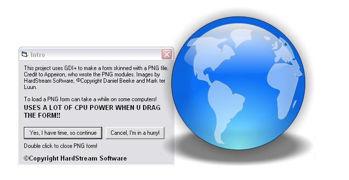



## Little Design thingy \(Uses GDI\+,png\) \.\.:D \-\*\*\*MUST SEE\*\*\*\-

### Description

Skin a form with a PNG image. Uses GDI+ and a lot of CPU :D

Credit to Appeiron, who wrote the GDI+ modules :P

You can also download the DLL version here @ PSC
 
### More Info
 

             |
---                |---
**Submitted On**   |2005-01-03 10:22:02
**By**             |[HardStream](https://github.com/Planet-Source-Code/PSCIndex/blob/master/ByAuthor/hardstream.md)
**Level**          |Intermediate
**User Rating**    |4.2 (25 globes from 6 users)
**Compatibility**  |VB 5\.0, VB 6\.0
**Category**       |[Graphics](https://github.com/Planet-Source-Code/PSCIndex/blob/master/ByCategory/graphics__1-46.md)
**World**          |[Visual Basic](https://github.com/Planet-Source-Code/PSCIndex/blob/master/ByWorld/visual-basic.md)
**Archive File**   |[Little\_Des183611132005\.zip](https://github.com/Planet-Source-Code/hardstream-little-design-thingy-uses-gdi-png-d-must-see__1-58085/archive/master.zip)

